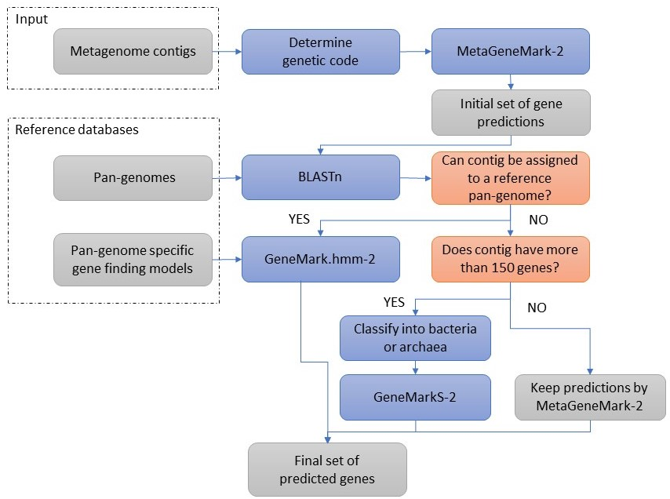

# GeneMark-HM
_GeneMark-HM: Improving Gene Prediction in DNA Sequences of Human Microbiome_  
(manuscript submitted for publication, 2020)  
  
Authors:  
 - Alex Lomsadze  
 - Christophe Bonny  
 - Francesco Strozzi  
 - Mark Borodovsky  

Copyright: GeneProbe Inc. Atlanta, GA, USA  
Copyright: Enterome. 94/96 avenue Ledru-Rollin 75011 Paris, France  
  
Release: January 2021  
  
## LICENSE
[LICENSE](LICENSE)  
READ THIS LICENSE AGREEMENT CAREFULLY BEFORE USING THIS PRODUCT. BY USING THIS PRODUCT YOU INDICATE YOUR ACCEPTANCE OF THE TERMS OF THE FOLLOWING AGREEMENT. THESE TERMS APPLY TO YOU AND ANY SUBSEQUENT LICENSEE OF THIS PRODUCT.

Additional information can be found on Geneprobe web site:  http://geneprobe.net/genemark_hm/

## Overview
GeneMark-HM is a pipeline for protein coding gene prediction in assembled metagenomes from human microbiome (HM). Pipeline integrates three algorithms from GeneMark gene finder family, MetaGeneMark-2, GeneMarkS-2 and Genemark.hmm-2, into a workflow with parameters optimized for analysis of human metagenomes. 



This pipeline is built around a fact, that gene prediction with species specific parameters usually outperforms gene prediction with more general metagenomics parameters. Species specific parameters are impossible to estimate from short contigs. For many species present in human gut microbiome, complete or almost genomes are available in public repositories. Accurate estimate of parameters can be done for such species by GeneMarkS-2 algorithm using complete genomes. This pipeline leverages the availability of data for many taxa. Database of species specific parameters was built for more than five thousand taxa, which are known to be present in the human gut metagenomes. Pipeline checks if a contig can be assigned to one of the reference taxa and in case of reliable assignment uses corresponding taxa specific parameters for gene finding in a contig. In cases when no taxa assignment was made one of the two algorithms GeneMarkS-2 or MetaGeneMark-2 are used to generate the gene prediction. Selection of algorithms on the latest step is based on the contig length.

Two databases form the core part of this pipeline. Database of genes is used on taxa assignment step and database of species specific parameters on gene prediction step. Quality of these two databases determine the gain in gene annotation accuracy from initial MataGeneMark-2 level.

## Pipeline code
* GeneMark-HM software is located in "bin" folder
* pan-genome sequences are located on Amazon S3 storage
* pan-genome specific gene finding models are located on Amazon S3 storage

## Instalation
Installation instructions are available in [INSTALL](INSTALL) file.

## Gene prediction
Pipeline creates output files and temporary working folder in the current working directory. It is recommended to run analyses in dedicated folder for each metagenome sequence.  
Multithreading is supported. Set "--cores" command line option according to available system resources.  

To generate predictions on metagenome assembly:  
```
mkdir some_work_dir
cd some_work_dir
nohup path_to/bin/gm_hm.pl --seq path_to/sequence.fasta --cores 4 --aa aa.fasta --nt nt.fasta --out output.gtf --verbose > logfile &
```
Option "--clean" can be specified to remove all the temporary files after code execution.  
It is recommended to run pipeline in verbose mode. In verbose mode information about performance of individual steps of pipeline is outputted on STDOUT.  

## Data and code used in the paper
Supporting materials used in the paper can be found in this repository:
https://github.com/GeneProbe/GeneMark-HM-exp

